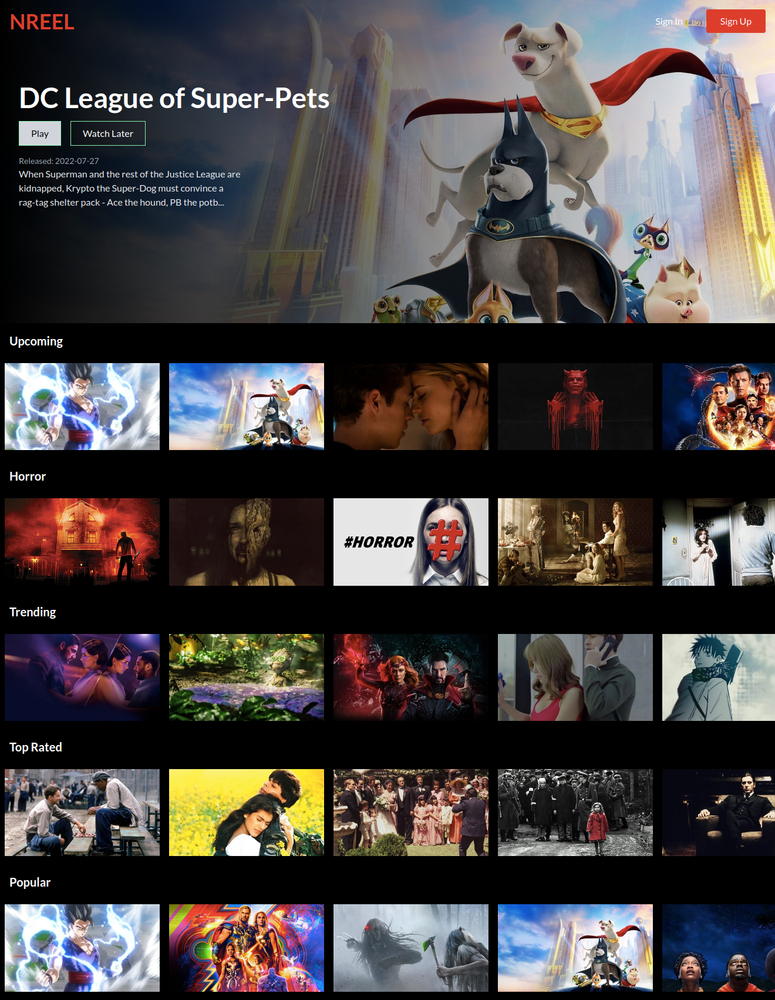

# NREEL NETFLIX CLONE

-App is live [here](https://n-reel.web.app/)

- Nreel is a movie information website that informs users of the latest and trending movies in different categories.

## Features

- Registration of new users
- Authentication of previous users - Login
- Ability to Save movies into a watch list.
  -Ability to remove movies from the watch list.
- Persistent watch list data

## Tech Stack

- React Js
  - Frontend UI
- Tailwind CSS
  - Styling
- Redux Toolkit

  - Fetching asyc data from the MOVIEDB api

- React Context Api
- Fetching and providing user data
- Firebase - Authentication
  - User auth and registration
- Firebase - Firestore
  - Document database for persisting movie favorites
- FireBase - Deployment
  - Deploying the app live

